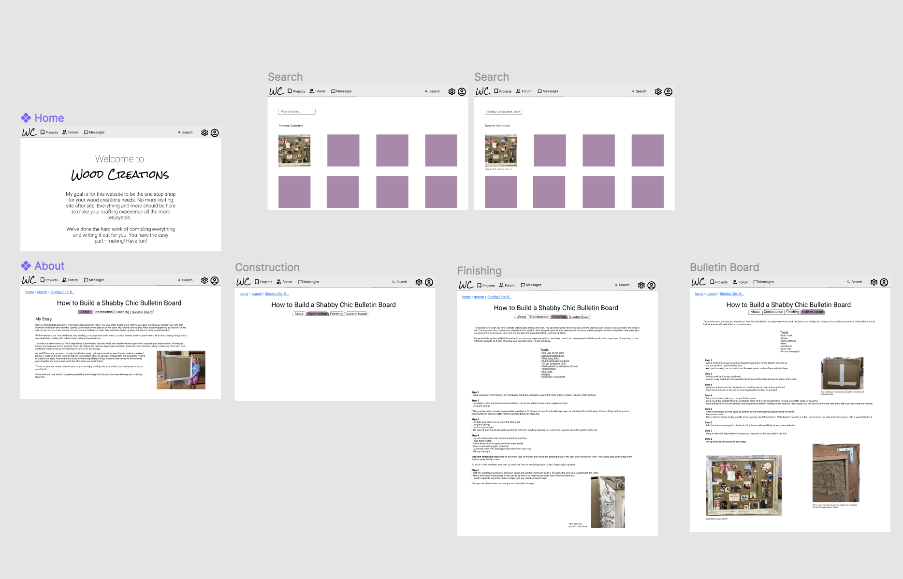
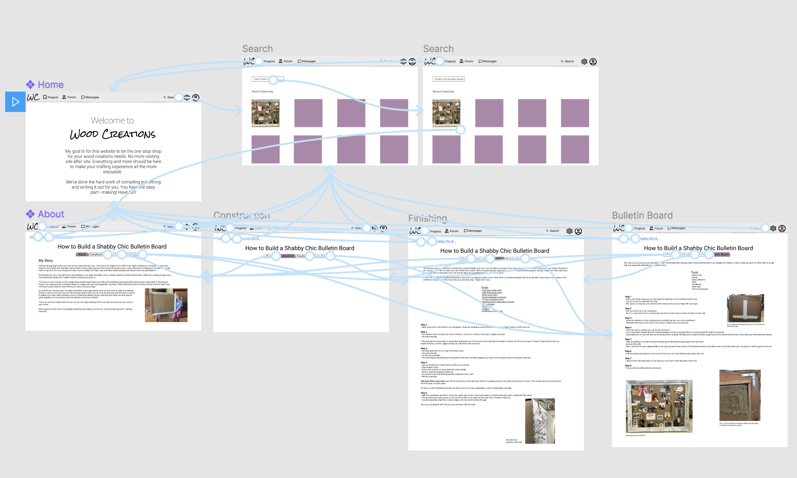
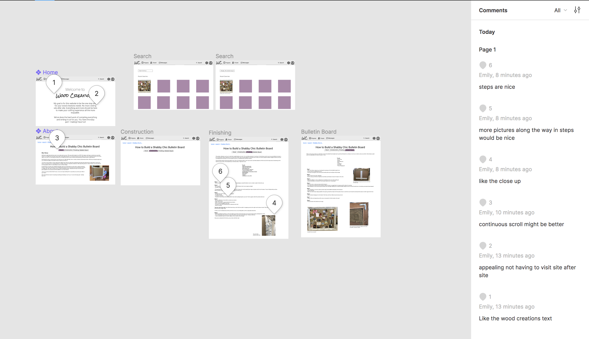
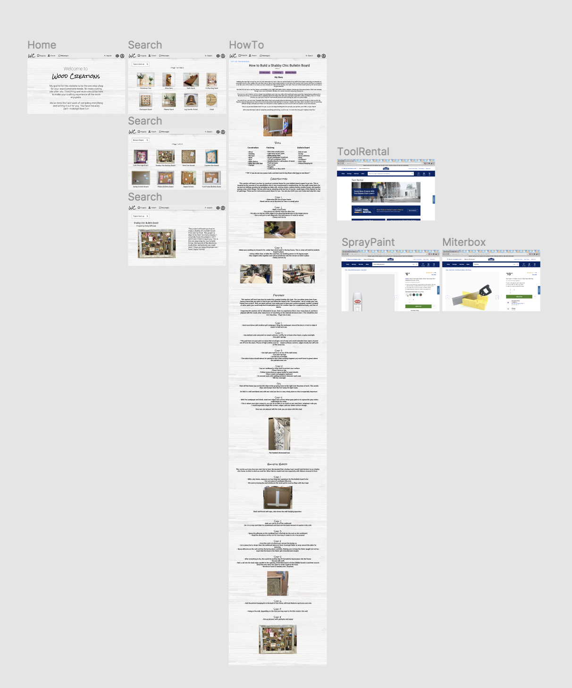
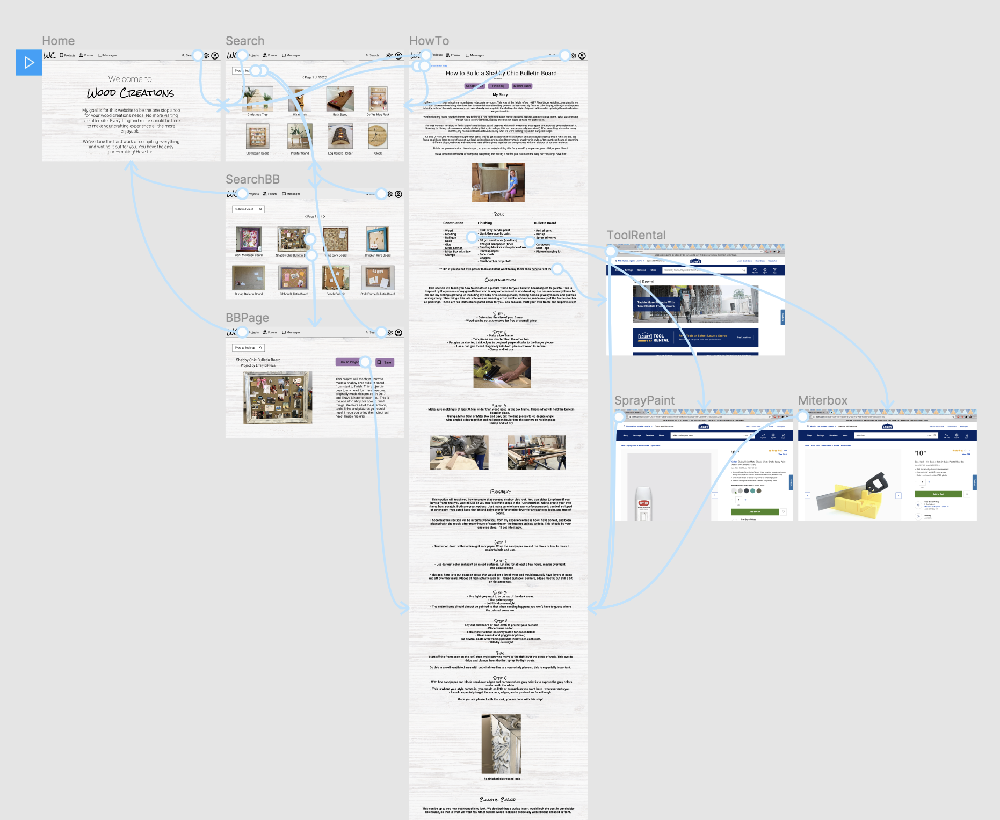
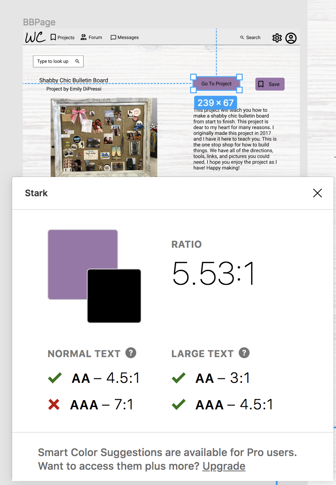
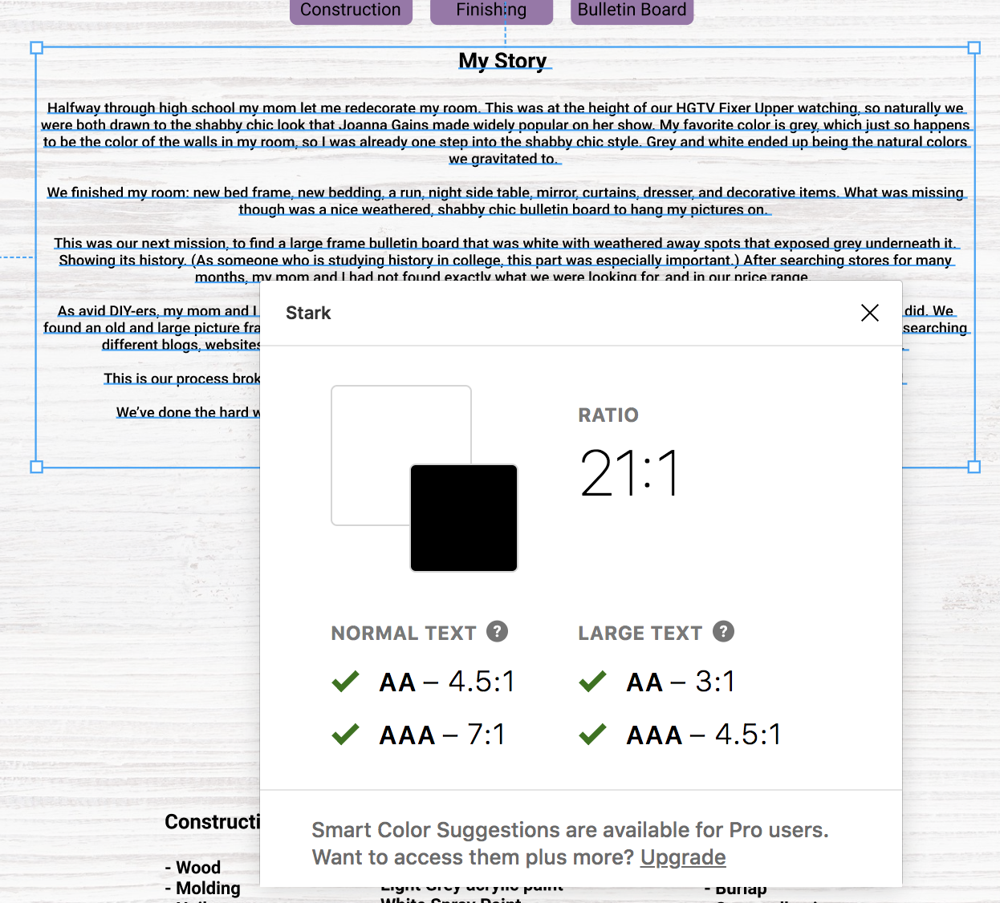

# High Fideilty 

## Emily DiPressi 

## High Fidelity: Part 1

I made my first high fidelity prototype on Figma. I wanted to keep the design relatively simple yet connect to the project. I decided on a light grey top bar to distinguish it from the rest of the page. I made the page a creamy white color, to give it more depth than just plain white. I kept everything else fairly simple, except for the title of the page and its icon in the corner. This hi fi prototype goes along with my wireframes part 2. It has navigable tabs across the top of the how-to page. The user would click on whichever tab they needed for what step they were currently on and to signify where they are in the website, the background of the tab changed to the color purple. 

The steps are listed out and pictures are on the side, which does not actually help in the step process. 

  

  

## Usability Test 

I did a usability test with my mom over zoom since she is within the demographics that this project is made for. Her comments were helpful in that she liked a continuous scroll with a jump to feature. She also would have liked to have seen more pictures throughout the steps, which I tried to do in my next iteration. (The comments say there were by me, but this test was conducted via Zoom and I shared my screen over Zoom and made the comments for her, as I figured that would make it easier on her, instead of her learning how to operate on Figma.)

  

## High Fideilty: Part 2

After my first high fidelity prototype, I got feedback from users that they would rather have a continuous scroll for the directions instead of navigable tabs, so in this iteration, I changed the flow of the website. I made one long page that is a continuous scroll, but also incorporated a “jump to” feature that a user recommended would be a good feature to have. I think this combines elements from all of the user’s feedback: scroll, yet a tab demarcation feature. 

I also created a better search page. The one in this iteration has a landing search page that has random, popular searches, with pictures and the name, the user will then “type in” the search bar (click) and will be taken to a search page for “bulletin boards.” From here the user clicks on the shabby chic one and they will be taken to a page in the search function that has a brief description of the project and on that page the user can either save the project for later or go right to the page now to start the making process. 

In addition to the changes to the pages, I added a light woodgrain background to the pages to give the website more character, as the first iteration seemed quite boring. I also interspersed the directional photos throughout the steps to be more useful to the user. I also added a few “hyperlinks” for the user to click on: the Lowe’s rental tool page, a listing for spray paint, and a miter saw box. 

  

  

I performed a text accessibility audit with Stark on Figma 

  
