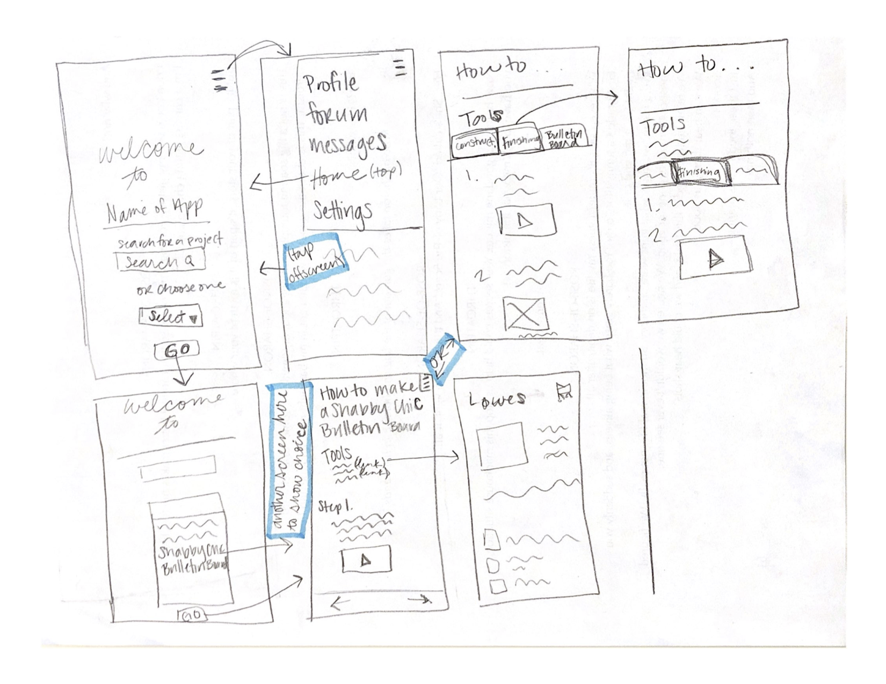
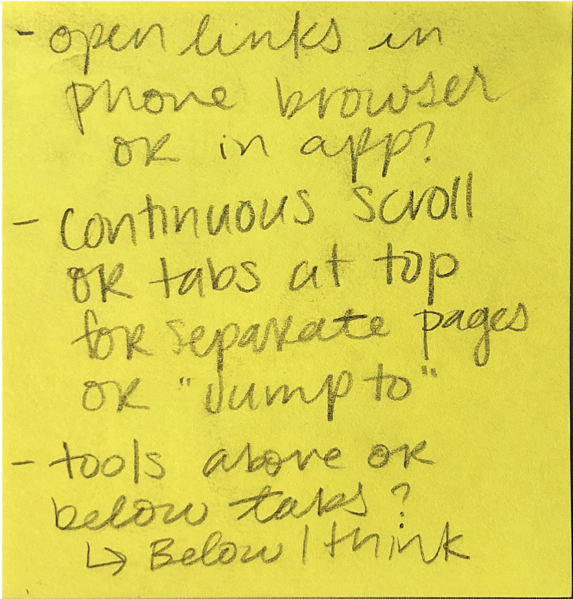
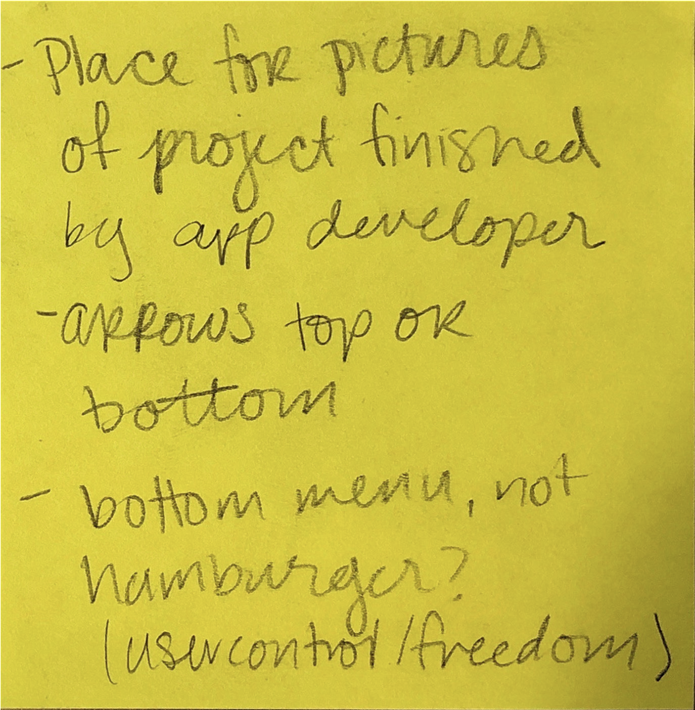

# Low Fidelity Prototype

## Emily DiPressi 

## Wireframe/Wireflow 

I have here a rough low fidelity prototype of the app I want to create to show how to make a shabby chic picture frame bulletin board. 

I have a few screens including a home page, a hamburger menu, and two options to find projects to make. 

## Self Cognitive Walk-through

I have a few ideas to work through after doing my own cognitive walk-through that I need to compare to a user’s evaluation and walk-through. 

  

## Additional Notes 

* How I want to organize the different steps? 
  * Is it better to have a continuous scroll with no markers at the top? Should I have tabs of the three major steps: “Construction,” “Finishing,” and “Bulletin Board”? Or have an option to “Jump To” certain parts of the process (same three as above). 
* How do I want to allow for user control and freedom?
  * I made a hamburger menu for the home screen and added arrows at the bottom, but I do not feel that most apps are designed this way. I do not want it to be awkward for the user to have to navigate around in the app. 
* How should links work?
  * Do they stay within the app and open a browser in app, which I sometimes feel is awkward as a user. Or should it go out of the app and open in the phones browser of choice? 
  * Maybe have the option to choose “Open in Bowser: Safari, Chrome”
* I think there should be a spot for pictures of the final product somewhere in the app. 
  * Might need more pages in-between choosing the project and going to the project directions. 
  * Have a place for pictures, look at others projects they’ve uploaded, and then to click on “Project Details” for the step-by-step. 
* Add a help option?
  * Could this be part of the forum? 
* Need to do more research from interview subjects to ask about how they like to learn online. 
