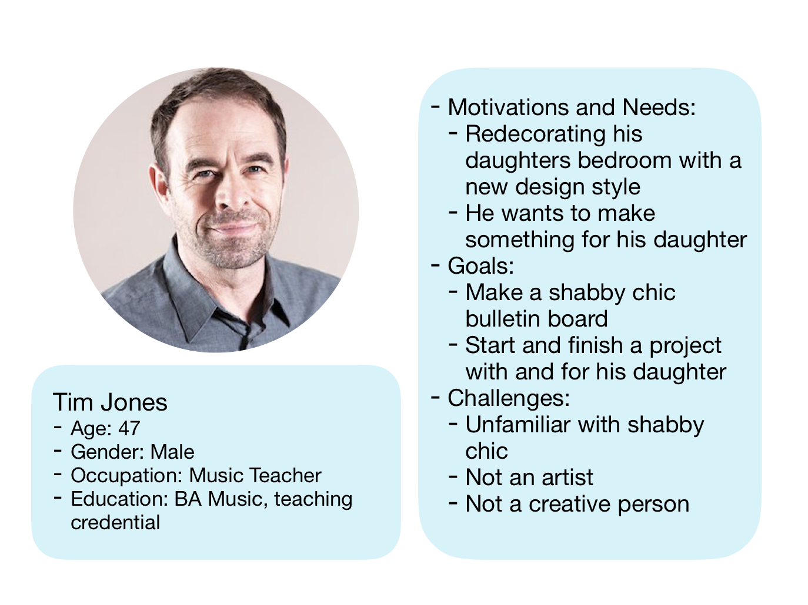
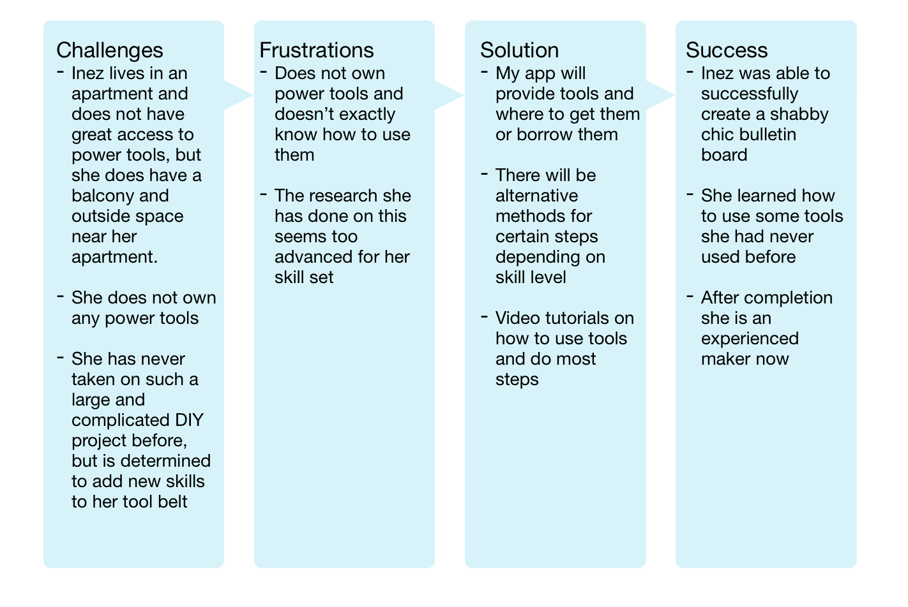

# UX Storytelling

## Emily DiPressi 

## Personas 

## Persona 1 
 

## Persona 2 
 

## User Journey Map 

## Persona 1: Inez

## Persona 2: Tim
 

## Scenarios 
Scenario 1: Inez 
* Inez has just moved to a new apartment and wants to redecorate. She has watched a lot of Fixer Upper on HGTV and duly has been inspired by Joanna Gaines’ design style. Inez decides she wants to make a shabby chic bulletin board picture frame. Inez is a creative person in her free time and loves doing different DIYs. She, however, does not really know how to use power tools, but she wants to learn how to use them to expand her knowledge base for future DIY projects.
* Inez finds my app and uses it as her guide on this project. The first step is to make the picture frame—the hardest part for her. With the help of the app, she makes a list of the materials needed: wood, nails, masks, sandpaper, and tools. She does now own any tools, so through the app she finds links to where she can purchase these things on the internet and other options, such as a renting them from a local hardware store. If all of this is truly unattainable—the power tools—the app will have alternative methods for such steps. With careful step by step directions and how-to videos on using tools in each step, Inez has successfully assembled a wooden picture frame. 
* The next step for her is to finish the frame in her signature shabby chic design. This is where she excels so, she reads the steps and knows them, but can take enough creative liberty and make the frame aesthetic design herself. 
* Finally, she will navigate to the last page in the creation of the bulletin board. Once again, Inez will read the instruction and view the accompanying pictures of the steps and successfully make a supportive backing for the cork to sit on and then will cover it with burlap, fit it into the picture frame opening, secure it together, and then hang it on the wall in her apartment for use. 

Scenario 2: Tim 
* Tim Jones is a father and husband. His daughter, Ellie, would like a shabby chic bulletin board. Tim thought it would be a fun project for the two of them to make together, so Tim wants to make a special declaration for his daughters bedroom. Tim is familiar with power tools and working with wood. Making the picture frame will most likely be intuitive for him. He has made some small things out of wood before, he has also built Ikea furniture and other flat packed things, and has fixed things around the house. 
* He will use my app for the general directions needed to construct a picture frame. He will know how to use most of the tools and have them at his disposal, as well. The part where my app will be the most useful to him will be in finishing. 
* Tim will navigate to the page that has the steps for creating a shabby chic look. He will find the necessary products and tools needed. He will follow the steps, that have written direction along with photographs of each step. After going through each step, following closely, but also taking some artistic creativity, he will have successfully finished his picture frame in a shabby chic style. 
* Once the frame has been created and painted, it will now be time for assembling it as a bulletin board. Tim will navigate to the final page that has the instructions for creating the bulletin board aspect. This part is more along the lines of Tim’s strengths. After reading the instructions and viewing the accompanying videos, Tim will have created the bulletin board and then successfully inserted it into the finished frame he made. A shabby chic picture frame bulletin board has been successfully made with the help of the app. 
