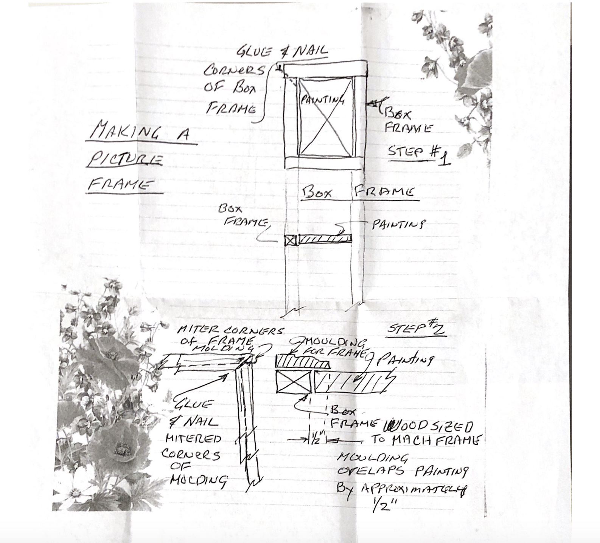

# User Research 

## Emily DiPressi 

### Interview with Colleen DiPressi

I interviewed her and asked questions about how to refinish an object to look shabby chic. 

Link to Questions and Answers: [Colleen Interview](https://docs.google.com/document/d/1Y75jBxtU4DGu1mj5DpIeUTsT-O_smlXpNZ5gwcKRqCE/edit?usp=sharing) 

### Interview with Thomas DiPressi

I interviewed my grandfather, Thomas DiPressi, over the phone about how to make a picture frame from scratch. At first he told me to go to a frame store and then after more explaining, on my mom's end (he is 88), he drew me an "engineer's blueprint" for making a picture frame. Once I recieved this in the mail I called him over the phone again and had him explain some of his drawings. 

Here is the blueprint he sent me:

  

Link to Questions and Answers: [Thomas Interview](https://docs.google.com/document/d/1Y75jBxtU4DGu1mj5DpIeUTsT-O_smlXpNZ5gwcKRqCE/edit?usp=sharing) 
### Summary of Findings

I have interviewed Colleen DiPressi so far. We discussed how to finish a frame in a shabby chic style. For the frame construction, I will interview Thomas DiPressi at a later date. I have learned the tools and the steps and techniques needed to finish a frame so it resembles something shabby chic. Briefly, what is needed is paint, sandpaper, cork, cardboard, and glue. From the steps and tools needed this does not seem like an advanced technique. My interviewee had never done this before. Making a shabby chic picture frame was the first time she had tried the technique. For my personas and scenarios, I can assume that beginners can do this step. As always, though, instructions will be spelled out as clearly as possible so even beginners can understand. 

I might want to reinterview and ask about the limitations of learning this technique from the internet. 
